# 🤖 Machine Learning

## [Home](https://github.com/lqminhhh/data-science-interview-prep/blob/main/README.md)

## A. What to Expect for ML Interview Questions:

- **Conceptual:** Do you have a strong theoretical ML background?
    - E.g.: "How does PCA work?", "What is your favorite ML model?", etc.
- **Resume-driven:** Have you actively applied ML before?
    - Be sure to explain every ML you mentioned in your resume
- **End-to-end modeling:** Can you apply ML to hypothetical business problem
    - E.g.: "How would you match Uber drivers to riders?", "How would you build a search autocomplete feature for Pinterest?" etc.

## B. Linear Algebra

### Eigenvalues and Eigenvectors

For some $n \times n$ matrix $A$, $x$ is an eigenvector of $A$ if: $Ax = \lambda x$, where $\lambda$ is a scalar. A matrix can represent a linear transformation and, when applied to a vector $x$, results in another vector called an *eigenvector*, which has the same direction as $x$ and in fact $x$ multiplied by a scaling factor $\lambda$ known as an *eigenvalue*.

### Eigendecomposition

The decomposition of a square matrix into its eigenvectors is called *eigendecomposition*. However, not all matrices are square. Non-square matrices are decomposed inusing a method called singular value decomposition (SVD). A matrix to which SVD is applied has a decomposition of the form: $A = U \sum V^T$, where $U$ is an $m \times n$ matrix, and $V$ is an $n \times n$ matrix.

## C. Gradient Descent

One popular optimization method is *gradient descent*, which takes small steps in the direction of steepest descent for a particular objective function. It's akin to racing down a hill. To win, you always take a "next step" in the steepest direction downhill.

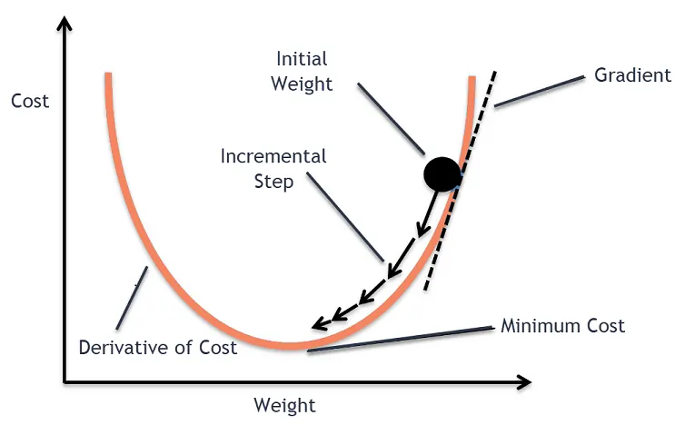

For convex functions, the gradient descent algorithm eventually finds the optimal point by updating the below equation until the value at the next iteration is very close to the current iteration (convergence):

$$
x_{t + 1} = x_t - \alpha_t \nabla f(x_t)
$$

that is, it calculates the negative of the gradient of the cost function and scales that by some constant $\alpha_t$, which is known as the learning rate, and then moves in that direction at each iteration of the algorithm.

**Note**: We can use a version of gradient descent called *stochastic gradient descent (SGD)* which adds an element of randomness so that the gradient does not get stuck. SGD uses one data point at a time for a single step and uses a much smaller subset of data points at any given stepo, but is nonetheless able to obtain an unbiased estimate of the true gradient. Alternatively, we can use *batch gradient descent (BGD)*, which uses a fixed, small number (a mini-batch) of data points per step.

## D. Model Evaluation and Selection

- Model evaluation: The process of evaluating how well a model performs on the *test set* after it's been trained on the *train set* (usually 80-20)

- Model selection: The process of selecting which model to implement after each model has been evaluated.

| Metric | Definition | Use Cases |
|------|-----------|-----------|
| MAE (Mean Absolute Error) | $\frac{1}{n}\sum_{i=1}^{n} \|y_i - \hat{y}_i\|$ | Regression when all errors are equally important and interpretability matters |
| MSE (Mean Squared Error) | $\frac{1}{n}\sum_{i=1}^{n} (y_i - \hat{y}_i)^2$ | Penalizes large errors more; useful when big mistakes are costly |
| RMSE (Root MSE) | $\sqrt{MSE}$ | Same units as target; common in regression benchmarking |
| $R^2$ (Coefficient of Determination) | $1 - \frac{\sum (y_i-\hat{y}_i)^2}{\sum (y_i-\bar{y})^2}$ | Explains variance captured by the model; not ideal alone for prediction quality |
| Accuracy | $\frac{TP + TN}{TP + TN + FP + FN}$ | Classification with balanced classes |
| Precision | $\frac{TP}{TP + FP}$ | When false positives are costly (e.g., fraud alerts) |
| Recall | $\frac{TP}{TP + FN}$ | When false negatives are costly (e.g., disease detection) |
| F1-score | $2 \cdot \frac{Precision \cdot Recall}{Precision + Recall}$ | Imbalanced classification requiring balance between precision and recall |
| ROC–AUC | Area under ROC curve | Measures ranking ability across thresholds; robust to class imbalance |
| Log Loss | $-\frac{1}{n}\sum [y\log(p)+(1-y)\log(1-p)]$ | Probabilistic classification; penalizes overconfident wrong predictions |

### Bias-Variance Trade-off

With any model, we are usuallying trying to estimate a function $f(x)$, which predicts our target variable $y$ based on our input $x$:

$$
y = f(x) + \omega
$$

where $\omega$ is noise, not captured by $f(x)$, and is assumed to be distributed as a zero-mean Gaussian random variable for certain regression problems. We can decompose the error of $y$ into the following:

1. **Bias:** how close the model's predicted values come to the true underlying $f(x)$ values, with smaller being better

2. **Variance:** the extent to which model prediction error changes based on training inputs, with smaller being better

3. **Irreducible error:** variation due to inherently noisy observation processes

Example:
- Linear regression: high bias, low variance
- Neural networks: low bias, high variance

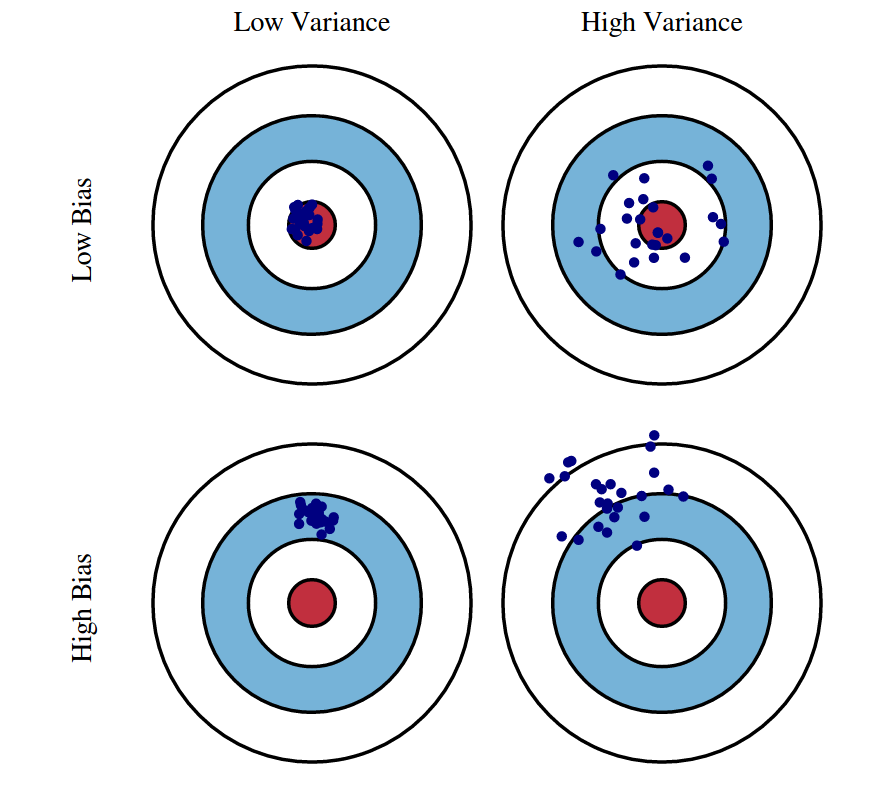

### Model Complexity and Overfitting

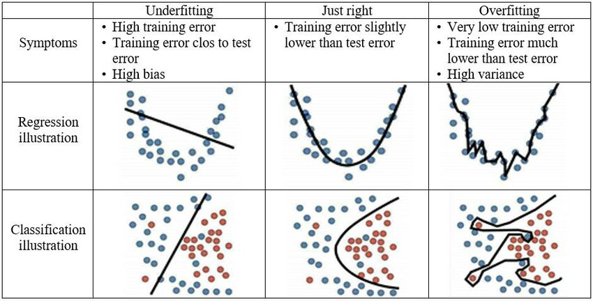

### Regularization

*L1 (LASSO):* The Lasso coefficients minimize:

$$
RSS + \lambda \sum_{j=1}^{p} |\beta_j|
$$

where $\lambda$ is the tuning parameter.

- Lasso has the effect of forcing some of the coefficients to be exactly equal to zero when $\lambda$ is sufficently large.
- It performs variable selection. We say that the lasso yields sparse model.

*L2 (Ridge):* The ridge regression coefficients are the values that minimize: 

$$
RSS + \lambda \sum_{j=1}^{p} \beta_j^2
$$

where $\lambda > 0$ is the tuning parameter, to be determined seperately.

- The ridge regression coefficients can change substantially when multiplying a given predictor by a constant. Therefore, it is best to apply ridge regression after standardizing the predictors.
- Select the best $\lambda$ by selection criteria.
- However, the ridge regression will include all $p$ predictors in the final model (disadvantages).

**Note**: The L1 and L2 penalties can also be linearly combined, resulting in a popular form of regularization called *elastic net*.

### Interpretability and Explainability

- Linear models: have weights which can be visualized and analyzed to interpret the decision making
- SHAPP (SHapley Additive exPlanation): uses "Shapley" values to denote the average marginal contribution of a feature over all possible combinations of inputs.
- LIME (Local Interpretable Model-agnostic Explanations): uses sparse linear models built around various predictions to understand how any model performs in that local vicinity

## E. Model Training

### Cross-Validation

Idea: Running the algorithm on subsamples of the training data and evaluating model performance on the portion of the data that was excluded from the subsample. This process is repeated many times for the different subsamples, and the results are combined at the end.

One popular way to do cross-validation is called *k-fold cross-validation*. The process is as follows:
1. Randomly shuffle data into equally-sized blocks (folds).
2. For each fold $k$, train the model on all data except for fold $i$, and evaluate the validation error using block $i$.
3. Average the $k$ validation errors from step 2 to get an estimate of the true error.

Another form is *leave-one-out cross-validation*. LOOCV is a special case of *k-fold* cross validation where $k$ is equal to the size of the dataset ($n$). That is, it is where the model is testing on every single data point during the cross-validation.

### Bootstrapping and Bagging

- Bootstrapping: drawing observations from a large data sample repeatedly (sampling with replacement) and estimating some quantity of a population by average estimates from multiple smaller samples. Use cases: small dataset, class imbalance.

- Ensemble learning: the process of averaging estimates from many smaller models into a main model. Each individual model is produced using a particular sample from the process. This process of bootstrap aggregation is also known as *bagging*.

### Hyperparameter Tuning

- Grid search: forming a grid that is the Cartesian product of those parameters and then sequentially trying all such combinations and seeing which yields the best results.

- Random search: define a distribution for each parameter and randomly sample from the joint distribution over all parameters.

### Training Times and Learning Curves

- Training times: Another facter to consider when it comes to model selection. While you can always train more complex models that might achieve marginally higher model performance metrics, the trade-off versus increased resource usage and training time might make such a decision suboptimal.

- Learning curvse: plots of model learning performance over time. The y-axis is some metric of learning (e.g. classification accuracy), and the x-axis is experience (time).

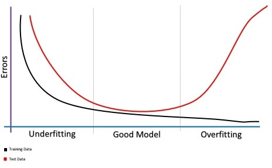

## F. Linear Regression

Linear regression is a form of *supervised learning*, where a model is trained on labeled input data. The goal is to estimate a function $f(x)$, such that each feature has a linear relationship to the target variable $y$, or:

$$
y = X \beta
$$

where $X$ is a matrix of predictor variables and $\beta$ is a vector of parameters that determines the weight of each variable in predicting the target variable.

### Evaluating Linear Regression

Evaluation of this model is built on the concept of *residual*: the distance between what the model predicted versus the actual value. Linear regression estimates $\beta$ by minimizing the residual sum of squares (RSS), which is given by the following:

$$
RSS(\beta) = (y - X \beta)^T(y - X \beta)
$$

Two other sum of squares concepts to know besides the RSS are the total sum of squares (TSS) and eplained sum of squares (ESS). The total sum of squares is the combined variation in the data (ESS + RSS). $R^2$, a popular metric for assessing good-ness-of-fit, is given by $R^2 = 1 - \frac{RSS}{TSS}$. It ramges between 0 and 1m and represents the proportion of variability in the data explained by the model.

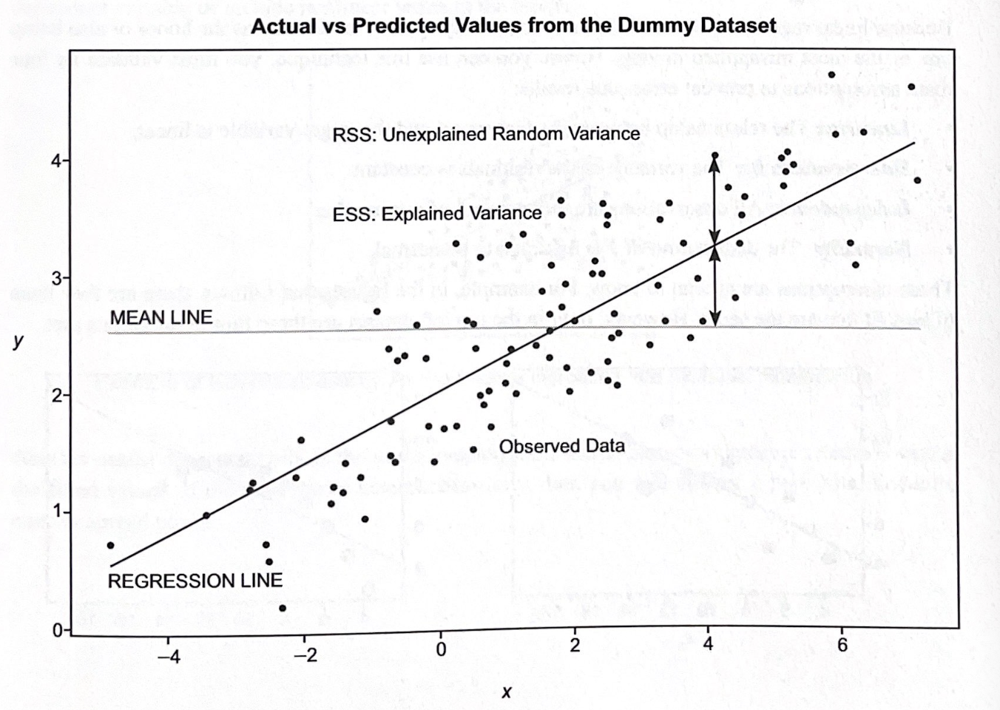

Other prominent error metrics:
- MSE (Mean squared error): mesaures the *variance* of the residuals -> penalizes larger errors more than MAE, making it more sensitive to outliers
- MAE (Mean absolute error): measures the *average* of the residuals.

### Subset Selection

- Best subset selection: try eaach model with $k$ predictors, out of $p$ possible ones, where $k<p$. Then, you choose the best subset model using a regression metric like $R^2$ -> **Can be computationally infeasible as $p$ increases**
- Stepwise selection: We aim to find a model with high $R^2$ and low RSS, while considering the number of predictors using metrics like AIC or adjusted $R^2$.
    - Forward selection: start with an empty model and iteratively add the most useful predictor
    - Backward selection: start with the full model and iteratively remove the least useful predictor.

### Assumptions

Four main assumptions to prevent erroneous results:
- **Linearity:** The relationship between the feature set and the target variable is linear
- **Homoscedasticity:** The variance of the residuals is constant.
- **Independence:** All observations are independent of one another.
- **Normality:** The distribution of $Y$ is assumed to be normal.

### Avoid Linear Regression Pitfalls

**Heteroscedasticity:** If the residuals of the residuals is not constant, then *heteroscedasticity* is most likely presented, meaning that the residuals are not identically distributed

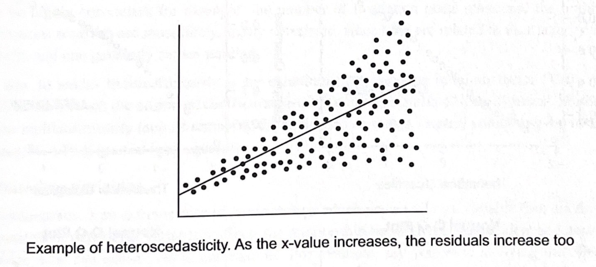

Another useful diagnostic plot is the scale-location plot, which plots standardized residuals versus the fitted values. If the data shows heteroscedasticity, then you will not see a horizontal line with equally spread points.

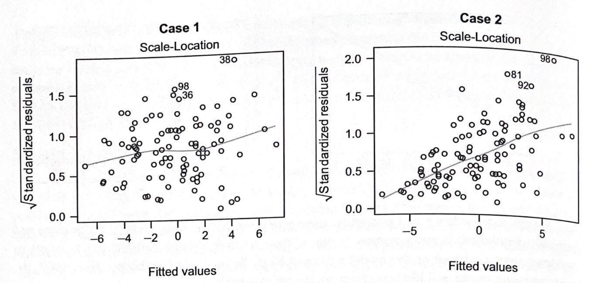

**Normality:** We can test if the residuals are normally distributed through a QQ plot.

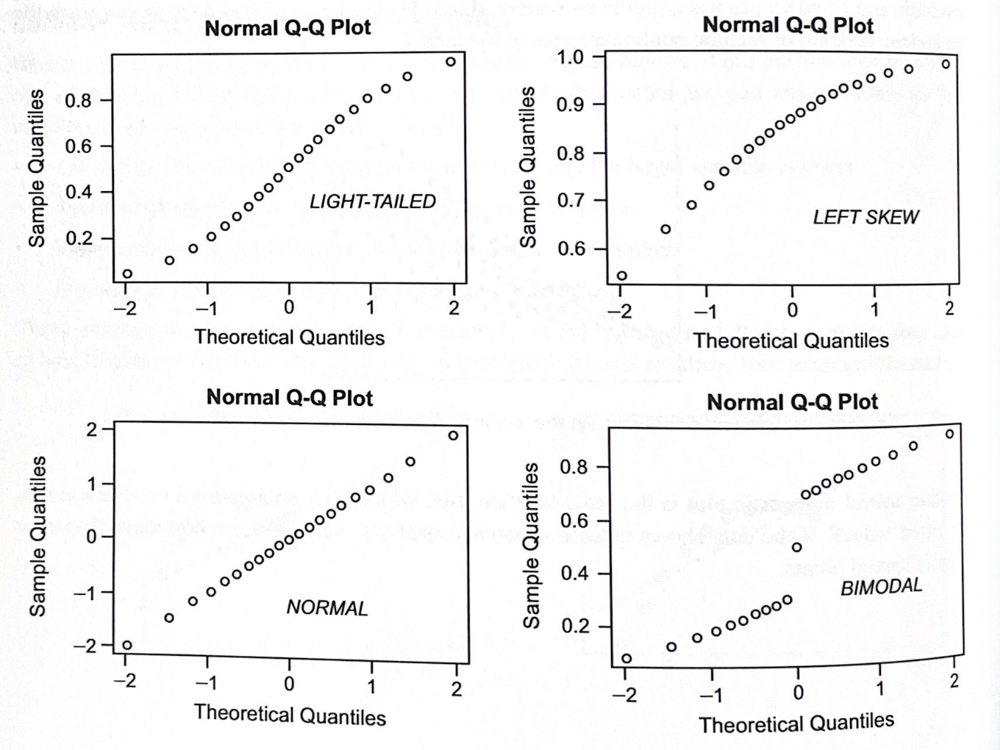

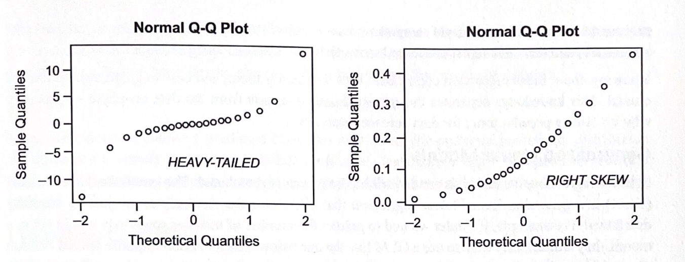

**Outliers:** this can have an outsized impact on regression results. One of the popular method to check this is examining *Cook's distance*, which is the estimate of the influence of any given data point. It takes into account the residual and leverage (how far away the $X$ value differs from that of other observations) of every point.

**Multicollinearity:** We can check this by examining the variance inflation factor (VIF), which quantifies how much the estimated coefficients are inflated when multicollinearity exists. Methods to address multicollinearity include removing the correlated variables, linearly combining the variables, or using PCA/PLS (partial least squares).

**Confounding Variables**: Multicollinearity is an extreme case of *confounding*, which occurs when a variable (but not the main independent or dependent variables) affects the relationship between the independent and dependent variables. This can cause invalid correlations. Confounding can occur in many ways:
- Selection bias: where the data are biased due to the way they were collected (e.g. group imbalance)
- Omitted variable bias: occurs when important variables are omitted, resulting in a linear regression model that is biased and inconsistent. Omitted variables can stem from dataset generation issues or choices made during modeling.

## G. Generalized Linear Models (GLMs)

The GLM is a generalization of linear regression that allows for the residuals to not just be normally distributed. The three common components to any GLM are:

|**Link Function**|**Systematic Component**|**Random Component**|
|-|-|-|
|$ln \lambda_i$|$=b_0 + b_1 x_i$|$+\epsilon$|
|$y_i$|$\sim \text{Poisson}(\lambda_i)$||

- **Random Component:** is the distribution of the error term, i.e., normal distribution for linear regression.
- **Systematic Component:** consists of the explanatory variables, i.e., the predictors combined in a linear combination.
- **Link function:** is the link between the random and system components, i.e., a linear regression, logit regression, etc.

Note that in GLMs, the response variable is still a linear combination of weights and predictors.

## H. Classification

### General Framework

The goal is to assign a given data point to one of $K$ possible classes instead of calculating a continuous value (as in regression). The two types of classification models are *generative models* and *discriminative models*. Generative models deal with the joint distribution of $X$ and $Y$, which is defined as follows:

$$
p(X, T) = p(Y|X)p(X)
$$

Maximizing a posterior probability distribution produces decision boundaries between classes where the resulting posterior probability is equivalent. The second type of model is discriminative. It directly determines a decision boundary by choosing the class that maximizes the probability:

$$
\hat{y} = \text{arg max}_k p(Y=k|x)
$$

Thus, both methods choose a predicted class that maximizes the posterior probability distribution; the difference is simply the approach.

### Evaluating Classifiers

**Confusion Matrix**: When building a classifier, we want to minimize the number of misclassified observations, which in binary cases can be termed false positives and false negatives. In a *false positive*, the model incorrectly predicts that an instance belongs to the positive class. For the cancer detection example, a false positive would be classifying an individual as having cancer, when in reality, the person does not have it. On
the other hand, a *false negative* occurs when the model incorrectly produces a negative class. In the cancer diagnostic case, this would mean saying a person doesn't have cancer, when in fact they do.

A *confusion matrix* helps organize and visualize this information. Each row represents the actual number of observations in a class, and each column represents the number of observations predicted as belonging to a class.

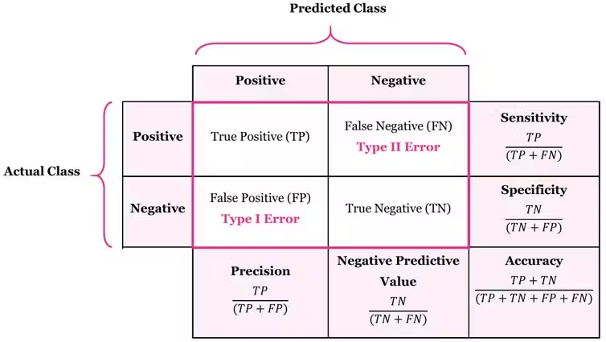

- **Precision:** The actual positive proportion of observations that were predicted positive by the classifier.
- **Recall (Sensitivity):** is the percentage of total positive cases captured, out of all positive cases.

In real-world modeling, there's a natural trade-off between optimizing for precision or recall. For example, having high recall - catching most people who have cancer - ends up saving the lives of some people with cancer. However, this often leads to misdiagnosing others who didn't truly have cancer, which subjects healthy people to costly and dangerous treatments like chemotherapy for a cancer they never had. On the flip side, having high precision means being confident that when the diagnostic comes back positive, the person really has cancer. However, this often means missing some people who tryly have the disease. These patients with missed diagnoses may gain a false sense of security, and their cancer, left unchecked, could lead to fatal outcomes. In cases where both precision and recall are equally important, you can optimize the *F1 score*: the harmonic mean of precision and recall:

$$
F_1 = 2 * \frac{precision * recall}{precision + recall}
$$

### Visualizing Classifier Performance

The receiver operating characteristic (ROC) curve plots the true positive rate versus the false positive rate for various thresholds. The area under the curve (AUC) measures how well the classifier separates classes. The AUC of the ROC curve is between 0 and 1, and a higher number means the model performs better in separating classes.

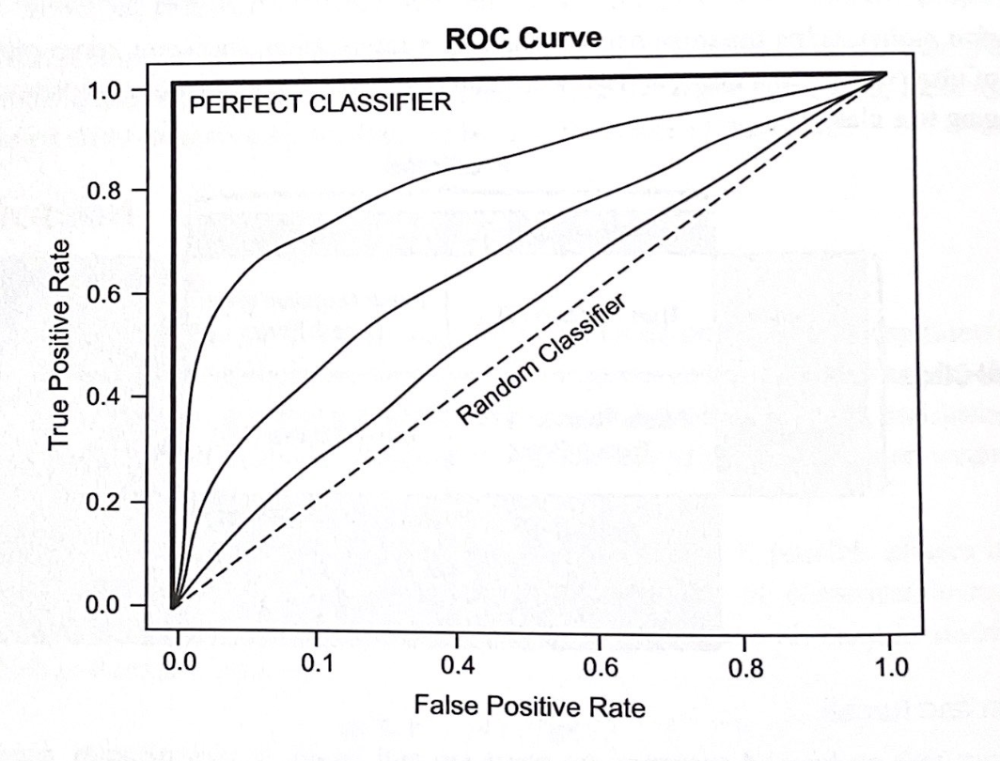

## I. Logistic Regression

In logistic regression, a linear output is converted into a probability between 0 and 1 using the sigmoid function:

$$
S(x) = \frac{1}{1 + e^{-X\beta}}
$$

In the equation above, $X$ is the set of predictor features and $\beta$ is the corresponding vector of weights. Computing $S(x)$ above produces a probability that indicates if an observation should be classified as a "1" (if the calculated probability is at least 0.5), and a "0" otherwise.

$$
P(\hat{Y}=1|X) = S(X\beta)
$$

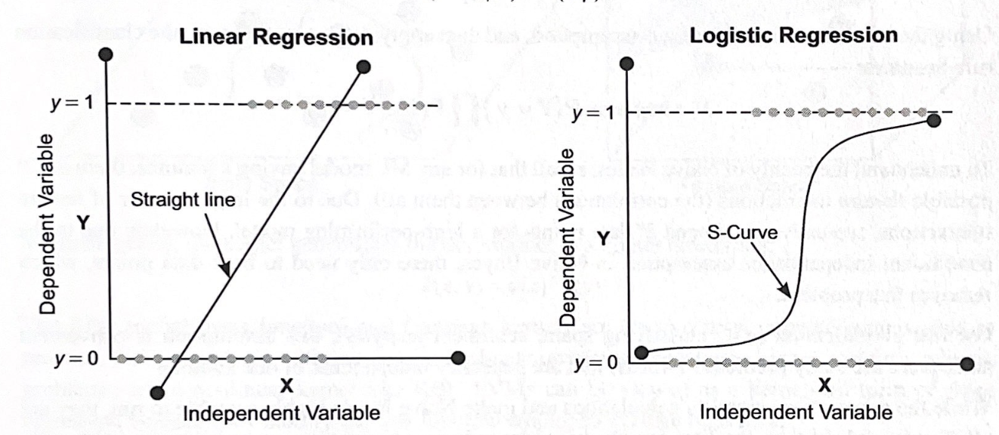

The loss function for logistic regression, also known as log-loss, is formulated as follows:

$$
L(\omega) = \sum_{i = 1}^n y_i log\left(\frac{1}{S(X\beta)}\right) + (1 - y_i)log\left(\frac{1}{1 - S(X\beta)}\right)
$$

Note that in cases when more than two outcome classes exist, softmax regression is a commonly used technique that generalizes logistic regression.

## J. Naive Bayes

Naive Bayes classifiers require only a small amount of training data to estimate the necessary parameters. They can be extremely fast compared to more sophisticated methods (such as support vector machines). 

Naive Bayes use Bayes' rule and a set of conditional independence assumptions in order to learn $P(Y|X)$. There are two assumptions:

1. It assumes each $X_i$ is independent of any other $X_j$ gievn $Y$ for any pair of features $X_i$ and $X_j$.
2. It assumes each feature is given the same weight.

The decoupling of the class conditional feature distributions means that each distribution can be independently estimated as a one-dimensional distribution. That is, we have the following:

$$
P(X_1...X_n|Y) = \prod_{i = 1}^n P(X_i|Y)
$$

Using the conditional independence assumption, and then applying Bayes' theorem, the classification rule becomes:

$$
\hat{y} = arg max_{y_i}P(Y = y_i) \prod_{j} P(X_j|Y = y_i)
$$

To understand the beauty of Naive Bayes, recall that for any ML model having $k$ features, there are $2^k$ possible feature interactions (the correlations between them all). Due to the large number of feature interactions, typically you would need $2^k$ data points for a high-performing model. However, due to the conditional independence assumption in Naive Bayes, there only need to be $k$ data points, which removes this problem.

For text classification (e.g. classifying spam, sentiment analysis), this assumption is convenient since there are manty predictors (words) that are generally independent of one another.

## K. Support Vector Machines (SVMs)

The goal of SVM is to form a hyperplane that linearly separates the training data. Specifically, it aims to maximize the margin, which is the minimum distance from the decision boundary to any training point. The points closest
to the hyperplane are called the support vectors. Note that the decision boundaries for SVMs can be nonlinear, which is unlike that of logistic regression, for example.

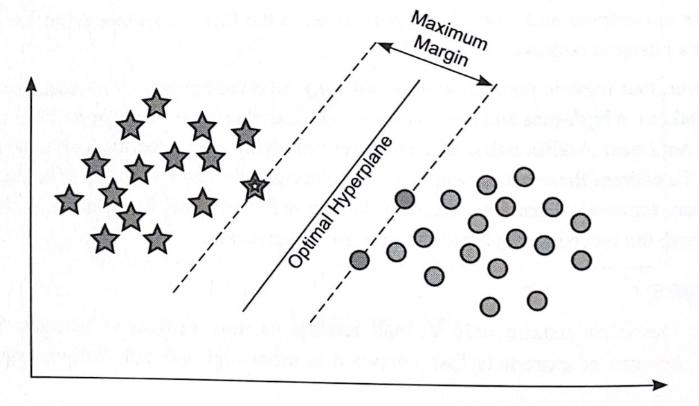

It's easy to visualize how a line can be found that separates the points correctly into their two classes. In practice, splitting the points isn't that straightforward. Thus, SVMs rely on a kernel to transform data into a higherdimensional space, where it then finds the hyperplane that best separates the points. The image below visualizes this kernel transformation:

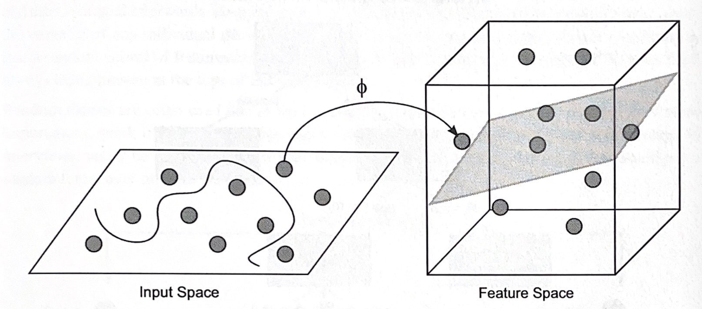

Mathematically, the kernel generalizes the dot product to a higher dimension:

$$
k(x, y) = \phi(x)^T \phi(y)
$$

The RBF (radial basis function) and Gaussian kernels are the two most popular kernels used in practice. The general rule of thumb for this: for linear problems, use a linear kernel, and for nonlinear problems, use a nonlinear kernel like RBF. SVMs can be viewed as a kernelized form of ridge regression because they modify the loss function employed in the ridge regression.

SVMs work well in high-dimensional spaces (a large number of dimensions vs the number of data points) or when a clear hyperplane divides the points. Conversely, SVMs don't work well on enormous data sets, since computational complexity is high, or when the target classes overlap and there is no clean separation. -> Use SVMs if you have nonlinear decision boundaries, and NOT use if interpretability is important.

## L. Decision Trees

### Training

A decision tree is a model that can be represented in a treelike form determined by binary splits made in the feature space and resulting in various leaf nodes, each with a different prediction. Trees are trained in a greedy and recursive fashion, starting at a root node and subsequently proceeding through a series of binary splits in features (i.e., variables) that lead to minimal error in the classification of observations.

### Entropy

The entropy of a random variable $Y$ quantifies the uncertainty in $Y$. For a discrete variable $Y$ (assuming $k$ states) it is stated as follows:

$$
H(Y) = - \sum_{i = 1}^k P(y = k)logP(Y = k)
$$

For example, for a simple Bernoulli random variable, this quantity is highest when $p = 0.5$ and lowest when $p = 0$ or $p = 1$, a behavior that aligns intuitively with its definition since if $p = 0$ or $1$, then there is no uncertainty with respect to the result. Generally, if a random variable has high entropy, its distribution is closer to uniform than a skewed one. There are many measures of entropy - in practice, the Gini index is commonly used for decision trees.

In the context of decision trees, consider an arbitrary split. We have $H(Y)$ from the initial training labels and assume that we have some features $X$ on which we want to split. We can characterrize the reduction in uncertainty given by the feature $X$, known as information gain, which can be formulated as follows:

$$
IG(Y, X) = H(Y) - H(Y|X)
$$

The larger $IG(Y, X)$ is, the higher the reduction in uncertainty in $Y$ by splitting on $X$. Therefore, the general process assesses all features in consideration and chooses the feature that maximizes this information gain, then recursively repeats the process on the two resulting branches.

## M. Random Forests

Typically, an individual decision tree may be prone to overfitting because a leaf node can be created for each observation. In practice, random forests yield better out-of-sample predictions than decision trees. A random forest is an ensemble method that utilize many decision trees, whose decisions it averages.

Two characteristics of random forests:
- Bagging: individual decision trees are fitted following each bootstrap sample and then averaged afterwards. It significantly reduces the variance of the random forest vs the variance of any individual decision trees.
- A random subset of features is considered at each split, preventing the important features from always being present at the tops of individual trees.

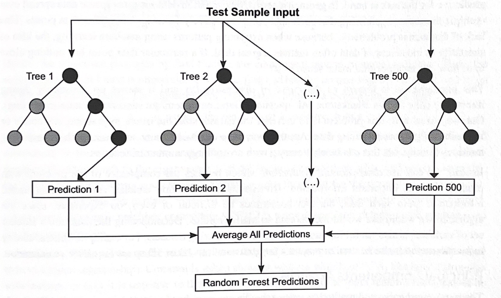

## N. Boosting

Boosting is a type of ensemble model that trains a sequence of "weak" models (such as small decision trees), where each on sequentially compensates for the weaknesses of the preceding models. Such weaknesses can be measured by the current model's error rate, and the relative error rates can be used to weigh which observations the next models should focus on. Each training point within a dataset is assigned a particular weight and is continually re-weighted in an iterative fashion such that points are mispredicted take on higher weights in each iteration. In this way, more emphasis is placed on points that are harder to predict. This can lead to overfitting if the data is especially noisy.

One example is *AdaBoost* (adaptive boosting), which is a popular technique used to train a model based on tuning a variety of weak learners. That is, it sequentially combines decision trees with a single split, and then weights are uniformly set for all data points. At each iteration, data points are re-weighted accroding to whether each was classified correctly or incorrectly by a classifier. At the end, weighted predictions of each classifier are combined to obtain a final prediction.

The generalized form of AdaBoost is called gradient boosting. A well-known form is called XGBoost (extreme gradient boosting). It is similar to AdaBoost, except that shortcomings of previous models are identified by the gradient rather than high weight points, and all classifiers have equal weights instead of having different weights.

## O. Dimensionality Reduction

### Principle Components Analysis (PCA)

## P. Clustering

### K-Means Clustering

### Hierarchial Clustering

### Gaussian Mixture Model (GMM)

## Q. Neural Networks

## R. Reinforcement Learning

## S. The End-to-End ML Workflow